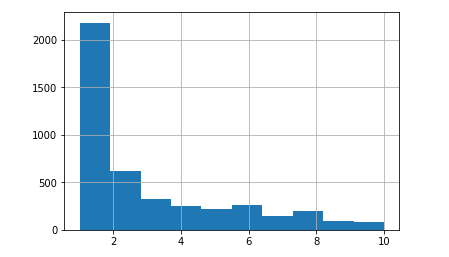
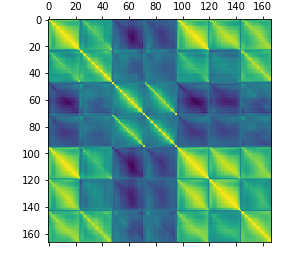
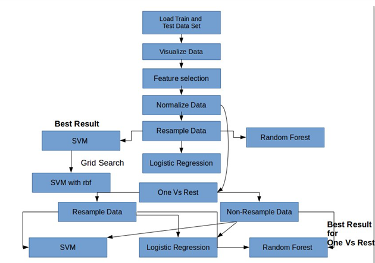
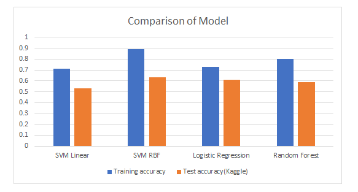

## Project Introduction 
The data analysis project involves the design of a complete machine learning solution. In
particular, the project revolves around the task of identifying the music genre of songs. This
is useful as a way to group music into categories that can be later used for recommendation
or discovery. 

## The Data description
The data is split into two datasets: a training data set with 4363 songs, and a test set dataset
with 6544 songs. Each song has 264 features, and there are 10 possible classes in total.
The dataset is a custom subset of the Million Song Dataset, and the labels were obtained
from AllMusic.com.

#### Music genre are as follows:

1. Pop_Rock
1. Electronic
1. Rap
1. Jazz
1. Latin
1. RnB
1. International
1. Country
1. Reggae
1. Blues 


#### Features of the song 
The features provided are a summary representation of the 3 main components of music:
timbre, pitch (melody and harmony) and rhythm. A very brief description of these
components: timre, pitch and rythm.  The final feature vector of each song consists of 264
dimensions: 168 values for the rhythm patterns (24 bands, 7 statistics), 48 values for the
chroma (12 bands, 4 statistics), and 48 values for the MFCCs (12 bands, 4 statistics).


## Loading the raw data 

#### Code snippet to load data 
```python
// Python pandas to load data 
# Load the data and cleanup
df_train = pd.read_csv("train_data.csv",header=None)
df_labels_train = pd.read_csv("train_labels.csv",header=None)
df_train["labels"] = df_labels_train[:]

### Checking  for NAN values in the dataset
x = df_train.isna().sum()
for x1 in x:
    if x1 != 0:
        print(x1)
df_test = pd.read_csv("test_data.csv",header=None)
```
#### Visualizing using Histogram and correlation matrix
```python
df_train['labels'].hist()
df_subset = df_train[list(range(0,167,1))]
plt.matshow(df_subset.corr())
```


As the classes are imbalanced, accuracy itself would not be that helpful to see if the performance is improving, so we get the confusion matrix which shows if for each class how many are being classified incorrectly. It can be seen clearly that class 1 has the most accuracy but few other classes are being misclassified more than it is classified correctly. Most of them are being classified to class 1 as the class 1 samples are more. That is why confusion matrix for the resampled data is again compared.



## Data Preparation

#### Filtering the columns which are not correlated with the label column
As not all the columns might be correlated with the label columns. That means the columns which do not add value to the prediction of the label are found out in the following logic through the correlation matrix. Training and checking through this filtered train was done with taking only most correlated features with chi square correlation[1] of more than absolute of the correlation statistics of 0.05 , 0.1, 0.2 but none of those increased the accuracy more than when all the fetaures were taken. It did not improve the overall accuracy so this method was not taken into consideration for final model.

```python
from sklearn.feature_selection import chi2

import numpy as np
corr_matrix = df_train.corr()
corr_with_label = corr_matrix["labels"].sort_values(ascending=False)

top_correlated_features = []
for index in corr_with_label.index:
    if abs(corr_with_label[index]) >= 0.05:
        top_correlated_features.append(index)
print(len(top_correlated_features))
print(top_correlated_features[:10])
X_filteredfeatures_train = df_train[df_train.columns[top_correlated_features[1:]]]
```
#### Removing the columns which have almost same values
There are columns where the value is same throughout the rows so the procedure implemented for this is to check if the values of 25th percentile, 50th percentile and 75th percentile are equal then those columns were eliminated.
```python 
columns_to_include = []

for i in X_train.columns:
    df_descrip = df_train[i].describe()
    if abs(df_descrip['25%'] - df_descrip['75%']) == 0 and abs(df_descrip['25%'] - df_descrip['50%']) == 0:
        continue
    columns_to_include.append(i)
print("Number of columns having almost similar values :")
print(str(len(X_train.columns) - len(columns_to_include)))
#print(columns_to_include)
X_filteredfeatures_train = df_train[df_train.columns[columns_to_include]]
df_test_filtered = df_test[df_test.columns[columns_to_include]]
#columns got eliminated
#20 columns with similar values get eliminated 
# These are not additing any value to the ML problem 
```

#### Normalize the data
While analysing the values for each feature we observed that there were values ranging from as high as 1milion to -0.002, therefore the decision to normalize the data was taken before creating the models. Normalization helped in improving the accuracy of each of the models.

#### Resampling of the Data
To handle the imbalanced classes, resampling is done to get better confusion matrix where the predictions of other classes than the first one will perform better. Different combinations were tried. Undersampling of Class 1 and over sampling of other classes was tried to improve the results in confusion matrix.

```python 
from sklearn import preprocessing
df_train_new = pd.DataFrame()
df_test_new = pd.DataFrame()
# Get column names first
names = X_filteredfeatures_train.columns
# Create the Scaler object
scaler = preprocessing.StandardScaler()
scaled_df = scaler.fit_transform(X_filteredfeatures_train)
df_train_new = pd.DataFrame(scaled_df, columns=names)

scaled_df = scaler.fit_transform(df_test_filtered)
df_test_new = pd.DataFrame(scaled_df, columns=names)
```

## Multiclass classification

#### Logistic Regression
Accuracy is 73% for the testing dataset. But as the goal was to handle the imbalanced classes well and see their improvement, the f1 score is comapared with other classifier scores. F1 score has definitely increased compared to the case when resampling was not done. There the score was 59% and the new f1 score obtained is 73%.

Logistic regression fits the data to a curve or sigmoid function, consist of a loss function to determine how well the data fits the defined function. The task is to maximize the log-likelihood by gradient descent to fit the parameters. Here we use the default sigmoid function and C=1e5 to obtain optimum predictions for logistic regressor.

#### SVM Classifier
Linear SVM ran on original normalized data gave the highest f1 score of 61% so grid search was ran for this to get better parameters for optimization and then after resampling on best parameters the SVM with C=10 and gamma=0.1 and kernel=rbf gave f1 score of 0.90 which gave best results in Kaggle as well.

SVM strives to achieve the optimum hyperplanes which categorises the data into the various classes. Linear SVM assumes that the data is linearly separable, but not always is the data linearly separable therefore we also used other kernels in SVM such as rbf and poly kernel. The other 2 important parameters while using the SVM are the C and gamma values. “C” is the penalty for misclassification, as we increase C it leads to larger error penalties which reduces bias, increases variance and creates more overfitting. Equivalently, smaller “C” increases bias, reduces variance and causes more underfitting. Higher values of gamma mean the data points are further apart, as we increase the gamma value we go towards data overfitting and lower gamma goes towards underfitting.

#### RandomForest Classifier
RandomForest classifier gave 47% f1 score which was the least before and after resampling it increasd to 80% which is better than Logistic regression but it did not result in better results on kaggle as compared to logistic. It gave at max 59% accuracy as opposed to logistic regression which gave 61% on kaggle.

Random forest is an ensemble method which builds random tress structure on the random samples of the data. The 3 most important parameters Random forest considers is the “n_estimators”, “max_features” and “max_depth, The higher values of “n_estimators” creates higher values of trees and more smoothing of data, it makes a predictiction by aggregating the individual trees predictions. The “max_features” specifies the maximum number of features in each node, smaller max_features yields more number of different trees by creating a random subset leading to more smoothing. Also, another parameter “max_depth” restricts the dept of the tree created by random forest. Various values were tweaked for the Random forest classifier, however the final parameter used for the optimum training accuracy was for max_depth = 8 and n_estimators =80.

```python 
# Linear SVM

X_tl = df_train_new
y_tl = df_train['labels']

X_train, X_test, y_train, y_test = train_test_split(X_tl, y_tl,shuffle=True, test_size = 0.2, random_state = 45)

clf = LinearSVC(random_state=0, tol=1e-5)
clf.fit(X_train, y_train)
#predictions_svm = clf.predict(X_test)
accuracy_SVM = clf.score(X_test, y_test)
print(accuracy_SVM)
predic = clf.predict(X_test)
print(classification_report(y_test,predic))
print(confusion_matrix(y_test, predic))


from sklearn import linear_model 
from sklearn import metrics
from sklearn.model_selection import cross_val_score
clf=linear_model.LogisticRegression(C=1e5)
#clf.fit(X_train,y_train)
#X_train, X_test, y_train, y_test = train_test_split(X_tl, y_tl, test_size=0.2, random_state=1)
clf.fit(X_train, y_train)

accuracy_logReg = clf.score(X_test,y_test)
#accuracy_logReg = clf.score(X_train, y_train)
# Printing the accuracy for the logistic regression
print("Accuracy of Logistic Regression")
print(accuracy_logReg)
predic = clf.predict(X_test)
print(classification_report(y_test,predic))
print(confusion_matrix(y_test, predic))


from sklearn.ensemble import RandomForestClassifier

#gave 99 percent accuracy
#regr = RandomForestRegressor(max_depth=10, random_state=15,oob_score = True,n_estimators=60)
clf = RandomForestClassifier(max_depth=8, random_state=15,oob_score = False,n_estimators=80)
clf.fit(X_train, y_train)


#model1 = LogisticRegression(random_state=0)
accuracy_RF = clf.score(X_test, y_test)
# Printing the accuracy for the logistic regression
print("Accuracy of Random Forest")
print(accuracy_RF)
predic = clf.predict(X_test)
print(classification_report(y_test,predic))
print(confusion_matrix(y_test, predic))

# 63% for LinearSVC, 59% for Logistic Regression , 57% for Random Forest
```
#### Check with resampling the data 
Resampling the data as the method mentioned above. Undersampling genre 1 class and oversampling the rest of the classes proportionately. Different trials were tested to find the optimal choice of sampling numbers for classes.
df_train_new['labels'] = df_train['labels'] 
```python 
from sklearn.utils import resample
df_train_new['labels'] = df_train['labels']
# Separate majority and minority classes
df_train_majority = df_train_new[df_train_new['labels']==1]
df_train_majority = resample(df_train_majority, 
                                     replace=False,     # sample without replacement
                                     n_samples=(1400),    # to match majority class
                                     random_state=123)
df_minority = df_train_new[df_train_new['labels']==2]
df_train_minority = resample(df_minority, 
                                     replace=True,     # sample with replacement
                                     n_samples=(1000),    # to make it close majority class
                                     random_state=123)
df_upsampled = pd.concat([df_train_majority, df_train_minority])
df_minority = df_train_new[df_train_new['labels']==3]
df_train_minority = resample(df_minority, 
                                     replace=True,     # sample with replacement
                                     n_samples=(600),    # to make it close majority class
                                     random_state=123)
df_upsampled = pd.concat([df_upsampled, df_train_minority])
for i in range(4,11):
    df_minority = df_train_new[df_train_new['labels']==i]
    #size = int(0.9*len(df_minority))
    #print(len(df_minority) + size)
    size = 600
    # Upsample minority class
    df_minority_upsampled = resample(df_minority, 
                                     replace=True,     # sample with replacement
                                     n_samples=(size),    # to make it close majority class
                                     random_state=123) # reproducible results
    df_upsampled = pd.concat([df_upsampled, df_minority_upsampled])
X_tl = df_upsampled[names]
# Assign labels to y_train
y_tl = df_upsampled['labels'] 
labels = df_upsampled['labels'].unique()
```

```python 
# Linear SVM


X_train, X_test, y_train, y_test = train_test_split(X_tl, y_tl, shuffle=True, test_size = 0.2, random_state = 45)

clf = LinearSVC(random_state=0, tol=1e-5)
clf.fit(X_train, y_train)
#predictions_svm = clf.predict(X_test)
accuracy_SVM = clf.score(X_test, y_test)
print("Linear SVC")
print(accuracy_SVM)
predic = clf.predict(X_test)
print(classification_report(y_test,predic))
print(confusion_matrix(y_test, predic))


from sklearn import linear_model 
from sklearn import metrics
from sklearn.model_selection import cross_val_score
clf=linear_model.LogisticRegression(C=1e5)
#clf.fit(X_train,y_train)
#X_train, X_test, y_train, y_test = train_test_split(X_tl, y_tl, test_size=0.2, random_state=1)
clf.fit(X_train, y_train)

accuracy_logReg = clf.score(X_test,y_test)
#accuracy_logReg = clf.score(X_train, y_train)
# Printing the accuracy for the logistic regression
print("Accuracy of Logistic Regression")
print(accuracy_logReg)
predic = clf.predict(X_test)
print(classification_report(y_test,predic))
print(confusion_matrix(y_test, predic))


from sklearn.ensemble import RandomForestClassifier

#gave 99 percent accuracy
#regr = RandomForestRegressor(max_depth=10, random_state=15,oob_score = True,n_estimators=60)
clf = RandomForestClassifier(max_depth=8, random_state=15,oob_score = False,n_estimators=80)
clf.fit(X_train, y_train)


#model1 = LogisticRegression(random_state=0)
accuracy_logReg = clf.score(X_test, y_test)
# Printing the accuracy for the logistic regression
print("Accuracy of Random Forest")
print(accuracy_logReg)
predic = clf.predict(X_test)
print(classification_report(y_test,predic))
print(confusion_matrix(y_test, predic))

clf = svm.SVC(kernel="rbf", gamma=0.1, C=10)
clf.fit(X_train, y_train)


#model1 = LogisticRegression(random_state=0)
accuracy_logReg = clf.score(X_test, y_test)
# Printing the accuracy for the logistic regression
print("Accuracy of SVM parameters from grid search:")
print(accuracy_logReg)
predic = clf.predict(X_test)
print(classification_report(y_test,predic))
print(confusion_matrix(y_test, predic))# Linear SVM
```
## Project flowchart 
The method and process can be explained by the below sequential flow and diagram.

It is to be noted that this process was an iterative process to determine the best accuracy and loss function but for convinience purposes only the sequential flow has been shown.

1. Loading Train and Test Data 
1. Data visualization with Histogram, Feature correlation matrix 
1. Feature Selection by removal of correlated column and similar value columns
1. Normalize Data
1. Resample Data 
1. SVM (Best result) , Logistic Regression, Random Forest 
1. Grid search for SVM (Kernel= rbf, C=10, gamma=0.1) 
1. Resample vs. Non-resample for One vs Rest 
1. SVM, Logistic Regression and Random Forest (Best result for one vs rest) 


## Results
Each of the model was evaluated using resampled training set of 7200 samples and a test set of 6544 test dataset songs with 244 features.

While analysing the values for each feature we observed that there were values ranging from as high as 1milion to -0.002, therefore normalization was done on the data before creating the models. Normalization helped in improving the accuracy of each of the models.

It was observed that from the class distribution histogram that there exists an imbalance in the class distribution. The class distribution for class 1 vs Other classes was almost 1:1 ratio resulting in misclassification resulting in prediction for most common class i.e. class 1/genre 1. Although there was high accuracy obtained, it turned out to be deluding or misleading on testing against the test dataset (Kaggle upload). This was also clearly seen when we created the confusion matrix. (Check above for confusion matrix provided for further details.)



Oversampling and under sampling methods were used to resample the data to avoid the mispredictions. Class 1 was under-sampled to 1400 random resampling strategies without the replacement. Class 2 was over-sampled to 1000 random samples with replacement. Remaining classes from 3 to 10 were over-sampled to 600 random samples. It is important to note in this case, the sampling was purposely not kept at 1:1 ration for all classes. Since class 1 to class 10 ratio was almost 25:1, therefore too much oversampling for class 10 or too less under-sampling for class 1 meant losing quality of the data. We tried various permutation and combination for the resampling strategies before finalizing on the ones which we used for the models. The confusion matrix also proved to be extremely useful for analysing the misleading classification even though we achieved a high accuracy for test data.

The final accuracies on Kaggle :

* Challenge 1: Highest Accuracy obtained is 0.63
* Challenge 2: Lowest Log-loss obtained is 0.194

## Discussion and Conclusion 
After applying various machine learning techniques on the dataset to achieve the best possible accuracy for classification, the highest test(validation) accuracy was achieved by Support vector machine with fine tuned parameter and rbf kernel and the least log loss in One Vs. rest classification method was achieved in RandomForest Regressor. RandomForest regressor works better on imbalanced data so it can be seen from the results as well as in the second case the results were achieved without resampling itself. These obtained results can be further extended to more music tracks, where each music track can be turned into same features that were used for these models and classified into its respective genre.

Some of the limitation and further exploration to increase accuracy are as follows:

To further improve this accuracy we need more data, especially from the imbalanced classes such as class 9 and class 10.
Machine learning methods explored were only 3 namely Support vector machines, Random forest and logistic regression. Therefore, it can be further explored for various other techniques such as KNN, Neural networks etc.
Feature refining can also be considered, other relevant features of the songs can be obtained in order to increase the accuracy of classification.
Dive deeper into fine tuning grid parameters for each of the techniques used to better overcome underfitting or over-fitting of the data. 

## References 
1. Correlation matrix https://datascienceplus.com/multi-class-text-classification-with-scikit-learn/
1. Music Genre Classification, Michael Haggblade, Yang Hong, Kenny Kao http://cs229.stanford.edu/proj2011/HaggbladeHongKao-MusicGenreClassification.pdf
1. Li T, Ogihara M, Li Q. A Comparative study on content-based music genre classification. In: Proceedings of the 26th annual international ACM SI-GIR conference on research and development in information retrieval. Toronto: ACM Press; 2003. p. 282–9
1. Music Genre Classification via Machine Learning, Li Guo(liguo94), Zhiwei Gu(zhiweig), Tianchi Liu(kitliu5) https://pdfs.semanticscholar.org/f179/e8abd5c4752c36a3505fb5f3abfb483687ca.pdf
1. Classifying the Subjective: Determining Genre of Music From Lyrics, Ahmed Bou-Rabee, Keegan Go, Karanveer Mohan, 2012, http://cs229.stanford.edu/proj2012/BourabeeGoMohan-ClassifyingTheSubjectiveDeterminingGenreOfMusicFromLyrics.pdf
1. For svm parameters https://pdfs.semanticscholar.org/f179/e8abd5c4752c36a3505fb5f3abfb483687ca.pdf
1. For code snippets: http://scikit-learn.org/stable/
