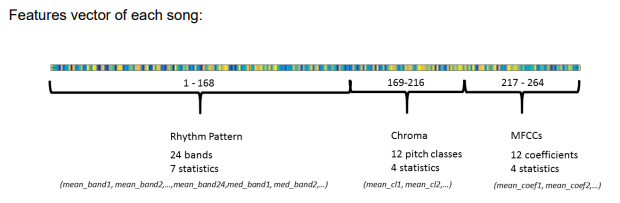

## Prediction and Classification of Songs in Genres 
The data analysis project involves the design of a complete machine learning solution. In
particular, the project revolves around the task of identifying the music genre of songs. This
is useful as a way to group music into categories that can be later used for recommendation
or discovery. 

## The Data 
The data is split into two datasets: a training data set with 4363 songs, and a test set dataset
with 6544 songs. Each song has 264 features, and there are 10 possible classes in total.
The dataset is a custom subset of the Million Song Dataset, and the labels were obtained
from AllMusic.com. 

### Music genre are as follows:

1. Pop_Rock
1. Electronic
1. Rap
1. Jazz
1. Latin
1. RnB
1. International
1. Country
1. Reggae
1. Blues 

### Features of the song 
The features provided are a summary representation of the 3 main components of music:
timbre, pitch (melody and harmony) and rhythm. A very brief description of these
components: 

